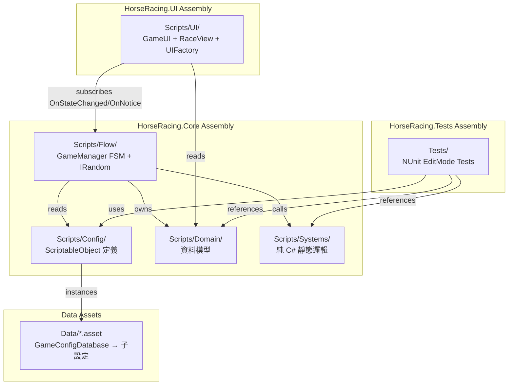
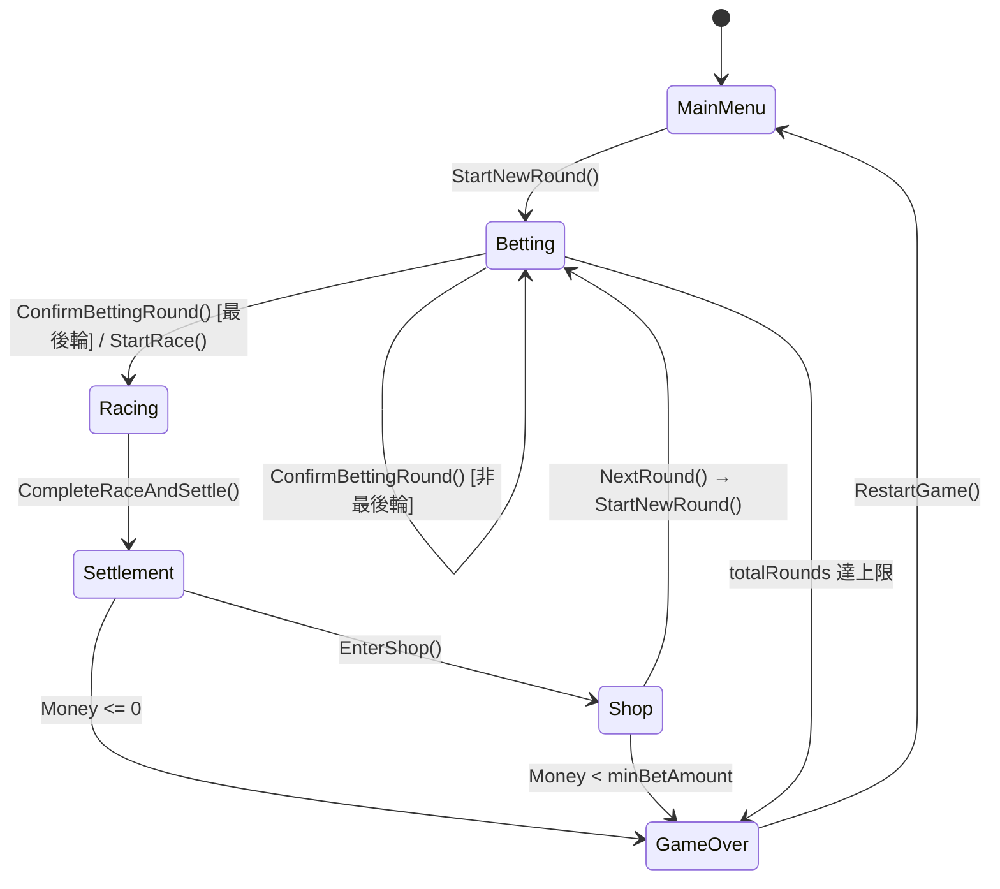
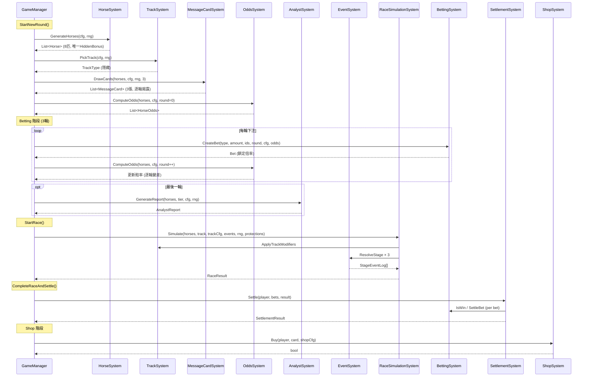
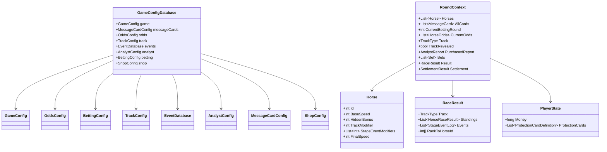

# Design Document: Horse Racing PRD Alignment

## Overview

本設計文件描述如何將 Unity 2D 賽馬投注模擬遊戲的實作與 PRD §2–§14 完整對齊。遊戲已具備核心架構（三層組件、純 C# 系統、設定驅動、事件通知），本設計聚焦於確認現有實作的完整性、識別缺口、並定義各系統間的精確互動契約。

### 設計目標

1. **完整性**：確保 PRD 中所有 20 項需求的每條 Acceptance Criteria 均有對應實作路徑
2. **確定性可測**：所有遊戲邏輯透過 IRandom 注入、純靜態系統可在 EditMode 獨立驗證
3. **設定驅動**：所有遊戲數值由 ScriptableObject 管理，零程式碼即可調整
4. **關注點分離**：Core 層不引用 UI，UI 透過事件訂閱與公開屬性讀取狀態

### 技術堆疊

- Unity 6000.4.11f1 + URP (2D)
- C# (.NET Standard 2.1 subset via Unity)
- NUnit (Unity Test Framework, EditMode)
- TextMeshPro + 微軟正黑體 SDF 中文字型
- Input System (new) + InputSystemUIInputModule

## Architecture

### 高階架構圖



### 依賴方向

```
HorseRacing.Tests → HorseRacing.Core
HorseRacing.UI   → HorseRacing.Core
```

UI 層僅能讀取 Core 公開的狀態與模型，不可反向依賴。GameManager 透過 `OnStateChanged` 事件通知 UI 刷新，透過 `OnNotice` 通知顯示訊息。

### 狀態機流程



## Components and Interfaces

### 1. Config Layer (`Scripts/Config/`)

| 類別 | 責任 | PRD 對應 |
|------|------|----------|
| `GameConfig` | 馬匹數、基礎速度、隱藏加成池、起始資金、最低下注、總回合數 | §3, §14 |
| `OddsConfig` | 排名基礎賠率陣列、輪次衰減係數、賠率下限 | §5 |
| `BettingConfig` | 六種投注類型定義（倍率、選馬數、是否有序）、下注輪次數 | §10 |
| `TrackConfig` | 賽道清單、8×3 偏好修正表 | §6 |
| `EventDefinition` | 單一事件：名稱、觸發率、修正值、目標類型 | §8 |
| `EventDatabase` | 所有可觸發事件集合 | §8 |
| `ProtectionCardDefinition` | 防禦卡：名稱、目標事件、防禦率、價格 | §11 |
| `ShopConfig` | 可售防禦卡清單、最大持有數 | §11 |
| `AnalystConfig` | 初級/資深價格與正確率、每份陳述數 | §7 |
| `MessageCardConfig` | 加成值→模糊描述對照表 | §4 |
| `GameConfigDatabase` | 主聚合器，引用所有子設定 | §14 |

### 2. Domain Layer (`Scripts/Domain/`)

| 類別 | 責任 |
|------|------|
| `Horse` | 馬匹實例：Id, BaseSpeed, HiddenBonus, TrackModifier, StageEventModifiers, FinalSpeed |
| `Bet` | 一筆投注：Type, Amount, HorseIds, Round, PayoutMultiplier |
| `MessageCard` | 消息卡：HorseId, Description, Round |
| `HorseOdds` | 馬匹賠率：HorseId, Rank, WinOdds |
| `AnalystReport` | 分析師報告：Tier, Statements |
| `StageEventLog` | 事件記錄：Stage, HorseId, EventName, SpeedModifier, Defended |
| `RaceResult` | 比賽結果：Track, Standings, Events, RankToHorseId |
| `HorseRaceResult` | 單馬結果：HorseId, FinalSpeed, Rank |
| `PlayerState` | 玩家狀態：Money, ProtectionCards |
| Enums | `GamePhase`, `TrackType`, `BetType`, `EventTarget`, `AnalystTier` |

### 3. Systems Layer (`Scripts/Systems/`)

所有系統為純靜態類別，無 MonoBehaviour 依賴，接受 `IRandom` 注入。

| 系統 | 公開方法 | 輸入 | 輸出 |
|------|---------|------|------|
| `HorseSystem` | `GenerateHorses(GameConfig, IRandom)` | 設定、RNG | `List<Horse>` |
| `OddsSystem` | `ComputeOdds(horses, OddsConfig, round)` | 馬匹清單、設定、輪次 | `List<HorseOdds>` |
| `MessageCardSystem` | `DrawCards(horses, MessageCardConfig, IRandom, rounds)` | 馬匹、設定、RNG | `List<MessageCard>` |
| `TrackSystem` | `PickTrack(TrackConfig, IRandom)` | 設定、RNG | `TrackType` |
| `TrackSystem` | `ApplyTrackModifiers(horses, track, TrackConfig)` | 馬匹、賽道、設定 | (mutates horses) |
| `AnalystSystem` | `GenerateReport(horses, tier, AnalystConfig, IRandom)` | 馬匹、等級、設定、RNG | `AnalystReport` |
| `EventSystem` | `ResolveStage(stage, horses, EventDatabase, IRandom, protections)` | 階段、馬匹、事件庫、RNG、防禦卡 | `List<StageEventLog>` |
| `RaceSimulationSystem` | `Simulate(horses, track, TrackConfig, EventDatabase, IRandom, protections)` | 馬匹、賽道、設定、事件、RNG、卡片 | `RaceResult` |
| `BettingSystem` | `CreateBet(type, amount, horseIds, round, BettingConfig, odds)` | 投注參數 | `Bet` |
| `BettingSystem` | `IsWin(bet, RaceResult)` | 投注、結果 | `bool` |
| `BettingSystem` | `SettleBet(bet, RaceResult)` | 投注、結果 | `long` (派彩) |
| `SettlementSystem` | `Settle(PlayerState, bets, RaceResult)` | 玩家、投注清單、結果 | `SettlementResult` |
| `ShopSystem` | `CanBuy(player, card, ShopConfig)` / `Buy(...)` | 玩家、卡片、設定 | `bool` |

### 4. Flow Layer (`Scripts/Flow/`)

| 類別 | 責任 |
|------|------|
| `GameManager` | MonoBehaviour FSM；串接所有系統、維護 PlayerState / RoundContext、發射事件 |
| `RoundContext` | 單回合資料容器：馬匹、消息卡、賠率、賽道、投注、結果、結算 |
| `IRandom` / `SystemRandom` | 隨機源抽象與實作 |

### 5. UI Layer (`Scripts/UI/`)

| 類別 | 責任 |
|------|------|
| `GameUI` | 程式化建構 Canvas + 六個面板（Menu/Betting/Race/Result/Shop/GameOver）、訂閱 GameManager 事件 |
| `RaceView` | 賽事動畫：2D 側視捲軸、8 匹馬左→右依名次抵達終點 |
| `UIFactory` | UI 建構工具方法（Panel, Button, Text, Layout 等） |

### 6. 關鍵介面契約

```csharp
public interface IRandom
{
    int Next(int maxExclusive);
    int Range(int minInclusive, int maxExclusive);
    float Value();  // [0, 1)
    void Shuffle<T>(IList<T> list);  // Fisher-Yates
}
```

GameManager 對外事件：
```csharp
public event Action OnStateChanged;       // 任何狀態改變
public event Action<string> OnNotice;     // 訊息/提示
```

## Data Models

### 核心資料流



### 關鍵資料結構關係



### 速度計算公式

```
FinalSpeed = BaseSpeed + HiddenBonus + TrackModifier + Σ(StageEventModifiers[0..n])
```

- **BaseSpeed**: 所有馬固定值（預設 30），由 `GameConfig.baseSpeed` 控制
- **HiddenBonus**: 從 `hiddenBonusPool` [0,1,2,3,4,5,6,7] 唯一分配
- **TrackModifier**: 由 `TrackConfig.preferences[horseId-1]` 依賽道類型查表
- **StageEventModifiers**: 三階段事件累積修正（正面/負面均可）

### 投注派彩規則

| 投注類型 | 中獎條件 | 倍率來源 |
|---------|---------|---------|
| Win | 選中馬第一名 | `OddsSystem` 動態賠率（下注當下鎖定） |
| Place | 選中馬前三名 | `BettingConfig.payoutMultiplier` |
| Quinella | 選中兩匹為前兩名（不分序） | `BettingConfig.payoutMultiplier` |
| Exacta | 選中兩匹依正確順序為前兩名 | `BettingConfig.payoutMultiplier` |
| Trio | 選中三匹為前三名（不分序） | `BettingConfig.payoutMultiplier` |
| Trifecta | 選中三匹依正確順序為前三名 | `BettingConfig.payoutMultiplier` |

### 遊戲結束條件

| 條件 | 判定位置 | 結果 |
|------|---------|------|
| `Money <= 0` | `CompleteRaceAndSettle()` 後 | 敗北（資金耗盡） |
| `Money < minBetAmount && Money > 0` | `NextRound()` | 敗北（資金不足以下注） |
| `RoundNumber >= totalRounds` (totalRounds > 0) | `StartNewRound()` | 依最終資金判定勝敗 |
| 勝利判定 | `Money >= startingMoney` | 獲勝 |
| 落敗判定 | `Money < startingMoney` | 落敗 |

## Correctness Properties

*A property is a characteristic or behavior that should hold true across all valid executions of a system — essentially, a formal statement about what the system should do. Properties serve as the bridge between human-readable specifications and machine-verifiable correctness guarantees.*

### Property 1: Horse Generation Produces Valid Unique Permutation

*For any* valid `GameConfig` with `horseCount = N` and a `hiddenBonusPool` of length ≥ N, calling `HorseSystem.GenerateHorses` SHALL produce exactly N horses with sequential IDs (1..N), all sharing the same `BaseSpeed`, and the set of `HiddenBonus` values across all horses SHALL be a permutation of the first N elements of the pool (each value appears exactly once).

**Validates: Requirements 3.1, 3.2, 3.3, 3.4**

### Property 2: Message Card Drawing Selects Distinct Horses with Correct Descriptions

*For any* set of 8 horses and a complete `MessageCardConfig`, calling `MessageCardSystem.DrawCards` SHALL produce exactly `rounds` cards referencing distinct horse IDs, and each card's `Description` SHALL equal `config.GetDescription(horse.HiddenBonus)` for the corresponding horse.

**Validates: Requirements 4.1, 4.2**

### Property 3: Message Card Reveal Filtering by Round

*For any* list of message cards with assigned round numbers and a current betting round N, the `RevealedCards` property SHALL return exactly those cards where `card.Round <= N`.

**Validates: Requirements 4.3**

### Property 4: Odds Ranking with Tie-Break

*For any* set of horses, `OddsSystem.ComputeOdds` SHALL produce a list sorted by `InitialScore` descending, and for any two horses with equal `InitialScore`, the one with the lower `Id` SHALL have the better (lower-numbered) rank.

**Validates: Requirements 5.1, 5.2**

### Property 5: Odds Formula Correctness

*For any* horse at rank position `i` and betting round `r`, the computed `WinOdds` SHALL equal `max(minOdds, baseRankOdds[i] × roundPayoutMultiplier[r])`.

**Validates: Requirements 5.3, 5.4, 5.5**

### Property 6: Odds Monotonic Decrease Across Rounds

*For any* horse and a config where `roundPayoutMultiplier` is strictly decreasing, the horse's `WinOdds` at round N SHALL be greater than or equal to the horse's `WinOdds` at round N+1.

**Validates: Requirements 5.6**

### Property 7: Track Modifier Application Matches Preference Table

*For any* horse with Id `H` and any track type `T`, calling `TrackSystem.ApplyTrackModifiers` SHALL set `horse.TrackModifier` to exactly `TrackConfig.preferences[H-1].{T}`.

**Validates: Requirements 6.4**

### Property 8: Track Selection Is Valid

*For any* `TrackConfig` with a non-empty tracks list, `TrackSystem.PickTrack` SHALL return a `TrackType` that exists in the configured tracks list.

**Validates: Requirements 6.1, 6.2**

### Property 9: Analyst Report Statement Count and Accuracy Mechanism

*For any* set of horses, analyst tier, and `AnalystConfig`, `AnalystSystem.GenerateReport` SHALL produce exactly `statementsPerReport` statements; and for each statement, if the RNG value was below the tier's accuracy rate, the statement SHALL be truthful (correctly reflects whether horse is in top 3 by InitialScore), otherwise misleading.

**Validates: Requirements 7.2, 7.4**

### Property 10: Event Trigger Mechanism

*For any* event with `triggerChance = C`, the event triggers if and only if the RNG produces a value less than C. When triggered with `target = AllHorses`, all horses are affected; when `target = RandomSingleHorse`, exactly one horse is affected.

**Validates: Requirements 8.1, 8.2, 8.3**

### Property 11: Event Speed Modifier Application

*For any* triggered event with `speedModifier = M` hitting a horse without defense, that horse's `StageEventModifiers` SHALL contain M as an appended value.

**Validates: Requirements 8.4**

### Property 12: Defense Card Consumption and Effect

*For any* negative event matching a held protection card: the card SHALL always be consumed (removed from the list) regardless of defense outcome; when defense succeeds (RNG value < `defendChance`), the speed modifier SHALL be 0 (fully nullified); when defense fails, the full speed modifier SHALL be applied.

**Validates: Requirements 9.1, 9.2, 9.3, 9.4**

### Property 13: Protection Card Maximum Hold Invariant

*For any* `PlayerState` and `ShopConfig`, `ShopSystem.Buy` SHALL refuse purchase when `ProtectionCards.Count >= maxHeldCards`, ensuring the count never exceeds the configured limit.

**Validates: Requirements 9.5, 13.4**

### Property 14: FinalSpeed Formula Invariant

*For any* horse after race simulation, `horse.FinalSpeed` SHALL equal `horse.BaseSpeed + horse.HiddenBonus + horse.TrackModifier + Σ(horse.StageEventModifiers)`.

**Validates: Requirements 10.2**

### Property 15: Race Result Ranking with Tie-Break

*For any* set of horses after simulation, the `RaceResult.Standings` SHALL be sorted by `FinalSpeed` descending, and for any two horses with equal `FinalSpeed`, the one with the lower `Id` SHALL rank higher. The result SHALL contain exactly one entry per horse.

**Validates: Requirements 10.3, 10.4, 10.5**

### Property 16: Bet Type Outcome Correctness

*For any* `RaceResult` with `RankToHorseId` and any bet, `BettingSystem.IsWin` SHALL return true if and only if:
- **Win**: `selected[0] == RankToHorseId[0]`
- **Place**: `selected[0]` is in `RankToHorseId[0..2]`
- **Quinella**: `{selected[0], selected[1]} == {RankToHorseId[0], RankToHorseId[1]}` (as sets)
- **Exacta**: `selected[0] == RankToHorseId[0] && selected[1] == RankToHorseId[1]`
- **Trio**: `{selected[0..2]} == {RankToHorseId[0..2]}` (as sets)
- **Trifecta**: `selected[i] == RankToHorseId[i]` for i=0,1,2

**Validates: Requirements 11.2, 11.3, 11.4, 11.5, 11.6, 11.7**

### Property 17: Bet Payout Multiplier Source

*For any* Win bet, `CreateBet` SHALL lock `PayoutMultiplier` to the horse's current dynamic `WinOdds`; for any non-Win bet, `CreateBet` SHALL use the `BettingConfig.payoutMultiplier` for that bet type.

**Validates: Requirements 11.8, 11.9**

### Property 18: Bet Validation Guards

*For any* bet attempt where `amount < minBetAmount` OR `amount > player.Money` OR `horseIds` is null/empty, `PlaceBet` SHALL return false and leave player money unchanged.

**Validates: Requirements 12.1, 12.2, 12.5**

### Property 19: Successful Bet Deducts Amount

*For any* valid bet (amount within bounds, valid horse selection, correct phase), `PlaceBet` SHALL return true and `player.Money` SHALL decrease by exactly the bet amount.

**Validates: Requirements 12.3**

### Property 20: Shop Purchase Deduction and Addition

*For any* successful purchase (sufficient funds, below max capacity), `ShopSystem.Buy` SHALL deduct exactly `card.price` from `player.Money` AND add the card to `player.ProtectionCards`.

**Validates: Requirements 13.2, 13.3**

### Property 21: Shop Purchase Rejection

*For any* attempted purchase where `player.Money < card.price`, `ShopSystem.Buy` SHALL return false and leave money and card list unchanged.

**Validates: Requirements 13.5**

### Property 22: Settlement Arithmetic Consistency

*For any* set of bets and race result, `SettlementSystem.Settle` SHALL produce a `SettlementResult` where:
- `TotalStaked == Σ(bet.Amount)` for all bets
- `TotalPayout == Σ(round(bet.Amount × bet.PayoutMultiplier))` for winning bets only
- `Net == TotalPayout - TotalStaked`
- `player.Money` increases by exactly `TotalPayout`

**Validates: Requirements 14.1, 14.2, 14.3, 14.4**

### Property 23: Multi-Round Money Accounting Invariant

*For any* valid multi-round game sequence, at every point in the game: `player.Money == startingMoney - Σ(all bet amounts placed) + Σ(all payouts received) - Σ(all shop purchases)`.

**Validates: Requirements 20.1, 20.5**

### Property 24: Game Over Win/Loss Determination

*For any* game-ending state, `GameWon` SHALL be true if and only if `player.Money >= startingMoney`, and false otherwise.

**Validates: Requirements 2.4, 2.5**

## Error Handling

### Input Validation

| 操作 | 驗證 | 失敗行為 |
|------|------|---------|
| `PlaceBet` | amount < minBetAmount | 拒絕 + Notice "最低下注 X" |
| `PlaceBet` | amount > player.Money | 拒絕 + Notice "資金不足" |
| `PlaceBet` | horseIds null/empty | 拒絕（靜默） |
| `PlaceBet` | Phase != Betting | 拒絕（靜默） |
| `BuyAnalystReport` | 已購買過 | 拒絕 + Notice "本回合已購買情報" |
| `BuyAnalystReport` | 資金不足 | 拒絕 + Notice "資金不足" |
| `BuyProtectionCard` | 超過上限 | 拒絕 + Notice |
| `BuyProtectionCard` | 資金不足 | 拒絕 + Notice |
| `StartNewRound` | config == null | LogError 並返回 |

### 邊界條件

- **空事件庫**：`EventSystem.ResolveStage` 接受空 EventDatabase，回傳空 logs
- **隱藏加成池不足**：`HorseSystem` 以 0 填補不足的池項
- **防禦卡清單為 null**：`EventSystem.TryDefend` 安全處理 null protections
- **無下注直接開賽**：Settlement 正常處理空 bets 清單（Net = 0）

### 狀態守衛

GameManager 的每個公開方法均檢查 `Phase` 前置條件：
- `PlaceBet` → Phase == Betting
- `ConfirmBettingRound` → Phase == Betting
- `StartRace` → Phase == Betting
- `CompleteRaceAndSettle` → Phase == Racing
- `EnterShop` → Phase == Settlement
- `BuyProtectionCard` → Phase == Shop
- `NextRound` → Phase == Shop or Settlement

## Testing Strategy

### 測試架構

- **框架**：NUnit (Unity Test Framework)
- **執行模式**：EditMode（不需 Play Mode，因系統為純 C#）
- **Assembly**：`HorseRacing.Tests` 引用 `HorseRacing.Core`
- **Property-Based Testing 函式庫**：FsCheck（透過 NuGet/手動引入 DLL）或使用自定義 generator 配合 NUnit `[TestCase]` 與迴圈驗證

### 雙軌測試方法

**Unit Tests（範例式）**：
- 各系統的 happy path 確認（已有完整覆蓋於 `SystemsTests.cs`）
- 邊界條件：空輸入、null 保護、上限突破
- 狀態機轉換正確性
- UI 事件訂閱行為

**Property Tests（通用性質）**：
- 每個 Correctness Property 對應一個 property-based test
- 最低 100 次迭代（隨機產生輸入）
- 透過 `FakeRandom` 或 `SystemRandom(seed)` 控制可重現性
- 標記格式：`// Feature: horse-racing-prd-alignment, Property {N}: {描述}`

### Property Test 設定

```csharp
// 每個 property test 最低配置
const int PropertyIterations = 100;

[Test]
public void Property_N_Description()
{
    // Feature: horse-racing-prd-alignment, Property N: {property text}
    var rng = new System.Random();
    for (int i = 0; i < PropertyIterations; i++)
    {
        // Generate random inputs
        // Execute system
        // Assert property holds
    }
}
```

### 測試覆蓋目標

| 層級 | 測試方式 | 目標 |
|------|---------|------|
| Systems | Property + Unit | 100% 公開方法、所有 24 correctness properties |
| Flow (GameManager) | Unit (需包裝為可測試的邏輯) | 狀態轉換、資金扣除、遊戲結束判定 |
| Config | Smoke | 確保所有設定欄位非 null、值合理 |
| UI | Manual + Example | 畫面正確顯示、事件訂閱正常 |

### 現有測試覆蓋分析

已實作的測試（`SystemsTests.cs`）涵蓋：
- ✅ HorseSystem: 唯一加成排列、序列 ID
- ✅ OddsSystem: 排名排序、tie-break、逐輪賠率遞減
- ✅ TrackSystem: 修正值套用
- ✅ MessageCardSystem: 3 張不重複、描述對應
- ✅ RaceSimulation: 無事件排名、tie-break
- ✅ EventSystem: 觸發與修正、防禦卡消耗
- ✅ BettingSystem: 六種投注判定、動態賠率鎖定
- ✅ ShopSystem: 扣款、上限、資金不足
- ✅ SettlementSystem: 派彩加總、Net 計算

需補充的 property tests 將針對上述 24 個 correctness properties，以隨機輸入進行廣泛驗證。

