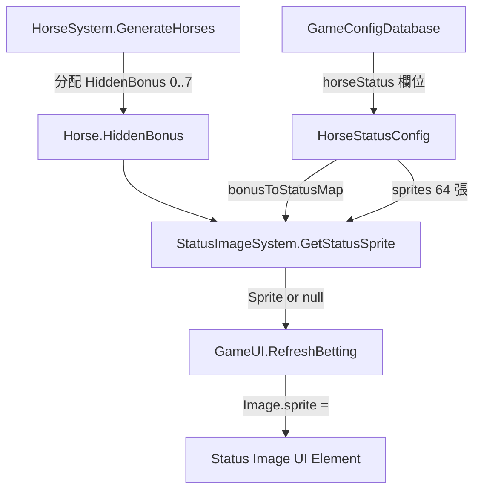

# Design Document: Horse Status Display

## Overview

本功能在下注面板的馬匹列表中，為每匹馬顯示一張狀態圖片。狀態圖片由每局隨機分配的 HiddenBonus（0..7 唯一排列）經 Config 定義的對應表轉換為狀態索引，再從 64 張預設 Sprite（8 匹馬 × 8 種狀態）中查詢取得。

資料流向：
```
HiddenBonus (0..7) → bonusToStatusMap[bonus] → statusIndex → sprites[horseIndex * 8 + statusIndex] → UI Image
```

設計遵循專案既有架構：
- Config-driven：所有可調整項（馬名、狀態名、對應表、圖片）存於 ScriptableObject
- Pure logic layer：`StatusImageSystem` 為靜態類別，不依賴 MonoBehaviour
- Programmatic UI：使用 `UIFactory` 在程式碼中建構 Image 元件

## Architecture



### 分層職責

| 層級 | 檔案 | 職責 |
|------|------|------|
| Config | `Scripts/Config/HorseStatusConfig.cs` | 持有名稱清單、對應表、64 張 Sprite 參照 |
| Systems | `Scripts/Systems/StatusImageSystem.cs` | 純邏輯：HiddenBonus → Sprite 查詢 |
| UI | `Scripts/UI/GameUI.cs` | 建構 Image 元件、每次 RefreshBetting 更新 sprite |
| Data | `Data/HorseStatusConfig.asset` | ScriptableObject 實體（Inspector 設定） |

## Components and Interfaces

### 1. HorseStatusConfig (ScriptableObject)

```csharp
// Scripts/Config/HorseStatusConfig.cs
namespace HorseRacing
{
    [CreateAssetMenu(fileName = "HorseStatusConfig", menuName = "HorseRacing/Horse Status Config")]
    public class HorseStatusConfig : ScriptableObject
    {
        [Header("馬匹名稱（索引 0..7）")]
        [Tooltip("8 匹馬的顯示名稱，順序對應馬匹索引")]
        public string[] horseNames = new string[8];

        [Header("狀態名稱（索引 0..7）")]
        [Tooltip("8 種狀態的顯示名稱，順序對應狀態索引")]
        public string[] statusNames = new string[8];

        [Header("HiddenBonus → 狀態索引對應（長度 8）")]
        [Tooltip("陣列第 N 個元素 = HiddenBonus=N 對應的狀態索引")]
        public int[] bonusToStatusMap = new int[8];

        [Header("狀態圖片（8×8 = 64 張）")]
        [Tooltip("一維陣列，索引 = horseIndex * 8 + statusIndex")]
        public Sprite[] sprites = new Sprite[64];

        /// <summary>
        /// 以馬匹索引與狀態索引查詢 Sprite。
        /// 任何索引超出範圍或 sprite 未指派時回傳 null。
        /// </summary>
        public Sprite GetSprite(int horseIndex, int statusIndex)
        {
            if (horseIndex < 0 || horseIndex > 7) return null;
            if (statusIndex < 0 || statusIndex > 7) return null;
            return sprites[horseIndex * 8 + statusIndex];
        }
    }
}
```

**設計決策：**
- 使用一維陣列 `sprites[64]` 而非二維陣列，因 Unity 的 SerializedProperty 對一維陣列支援較佳，Inspector 編輯更方便。
- `bonusToStatusMap` 獨立於 sprites 陣列，允許設計師自由調整加成值與狀態的對應而不需移動圖片。

### 2. StatusImageSystem (Static Class)

```csharp
// Scripts/Systems/StatusImageSystem.cs
namespace HorseRacing
{
    /// <summary>
    /// 狀態圖片系統：將馬匹的 HiddenBonus 轉換為對應的狀態 Sprite。
    /// 純靜態邏輯，無狀態、無副作用。
    /// </summary>
    public static class StatusImageSystem
    {
        /// <summary>
        /// 取得指定馬匹在當前局的狀態 Sprite。
        /// </summary>
        /// <param name="config">狀態設定檔（可為 null）</param>
        /// <param name="horseIndex">馬匹索引 0..7</param>
        /// <param name="hiddenBonus">該馬被分配的 HiddenBonus 值</param>
        /// <returns>對應的 Sprite；任何參數無效時回傳 null</returns>
        public static Sprite GetStatusSprite(HorseStatusConfig config, int horseIndex, int hiddenBonus)
        {
            if (config == null) return null;
            if (hiddenBonus < 0 || hiddenBonus > 7) return null;
            int statusIndex = config.bonusToStatusMap[hiddenBonus];
            return config.GetSprite(horseIndex, statusIndex);
        }
    }
}
```

**設計決策：**
- 不需要 `IRandom` 參數，因為此系統只做查詢不做隨機生成。
- 將 `config` 作為參數傳入而非靜態持有，維持無狀態設計，也便於測試時注入不同設定。

### 3. GameConfigDatabase 擴充

```csharp
// 新增欄位至 GameConfigDatabase.cs
public HorseStatusConfig horseStatus;
```

### 4. GameUI 整合

在 `BuildBettingPanel` 中建立 Image 元件：

```csharp
// 在 chip 之後、txt 之前插入
var statusGo = UIFactory.NewUIObject("StatusImg", row.transform);
var statusImg = statusGo.AddComponent<Image>();
statusImg.preserveAspect = true;
statusImg.raycastTarget = false;
UIFactory.LE(statusGo, prefH: 48, prefW: 48);
statusGo.SetActive(false); // 預設隱藏，RefreshBetting 時再設定
_horseStatusImages.Add(statusImg);
```

在 `RefreshBetting` 中更新 sprite：

```csharp
for (int i = 0; i < 8; i++)
{
    var sprite = StatusImageSystem.GetStatusSprite(Cfg.horseStatus, i, _gm.Round.Horses[i].HiddenBonus);
    if (sprite != null)
    {
        _horseStatusImages[i].sprite = sprite;
        _horseStatusImages[i].gameObject.SetActive(true);
    }
    else
    {
        _horseStatusImages[i].gameObject.SetActive(false);
    }
}
```

## Data Models

### HorseStatusConfig 資料結構

| 欄位 | 類型 | 長度 | 說明 |
|------|------|------|------|
| horseNames | string[] | 8 | 馬匹顯示名稱 |
| statusNames | string[] | 8 | 狀態顯示名稱 |
| bonusToStatusMap | int[] | 8 | HiddenBonus→狀態索引對應 |
| sprites | Sprite[] | 64 | 狀態圖片（horseIndex×8+statusIndex） |

### 預設資料

**horseNames（索引 0..7）：**
囚犯、墓碑、石頭、貓利、輪椅、金魚、馬、Tardis

**statusNames（索引 0..7）：**
上場比賽剛結束、剛睡飽、嗨的飛起、心情很好、是上次冠軍、狀態很差、胃口不好、看起來很Chill

**bonusToStatusMap 預設值：**
`{0, 1, 2, 3, 4, 5, 6, 7}`（一對一對應，可由設計師在 Inspector 調整）

### 圖片檔案放置位置

`Assets/HorseRacing/Art/Horses/Status/` 目錄下，共 64 張 PNG：
- 命名建議：`Horse{horseIndex}_Status{statusIndex}.png`
- 在 HorseStatusConfig.asset 的 Inspector 中逐一拖入對應欄位

## Correctness Properties

*A property is a characteristic or behavior that should hold true across all valid executions of a system—essentially, a formal statement about what the system should do. Properties serve as the bridge between human-readable specifications and machine-verifiable correctness guarantees.*

### Property 1: Config sprite lookup correctness

*For any* valid horse index (0..7) and valid status index (0..7), `HorseStatusConfig.GetSprite(horseIndex, statusIndex)` shall return `sprites[horseIndex * 8 + statusIndex]`.

**Validates: Requirements 1.4**

### Property 2: Full data flow pipeline

*For any* valid HiddenBonus value (0..7), valid horse index (0..7), and valid bonusToStatusMap configuration, `StatusImageSystem.GetStatusSprite(config, horseIndex, hiddenBonus)` shall return `config.sprites[horseIndex * 8 + config.bonusToStatusMap[hiddenBonus]]`.

**Validates: Requirements 2.2**

### Property 3: Out-of-range safety

*For any* integer values of horseIndex or hiddenBonus where either is outside the range [0, 7], both `HorseStatusConfig.GetSprite` and `StatusImageSystem.GetStatusSprite` shall return null without throwing an exception.

**Validates: Requirements 1.6, 2.4, 4.3**

### Property 4: Null config safety

*For any* combination of horseIndex and hiddenBonus values, when the config parameter is null, `StatusImageSystem.GetStatusSprite(null, horseIndex, hiddenBonus)` shall return null without throwing an exception.

**Validates: Requirements 4.4**

### Property 5: Determinism

*For any* valid inputs (config, horseIndex, hiddenBonus), calling `StatusImageSystem.GetStatusSprite` multiple times with the same arguments shall always return the same result.

**Validates: Requirements 2.3**

## Error Handling

| 情境 | 處理方式 | 層級 |
|------|----------|------|
| horseIndex 或 statusIndex 超出 0..7 | 回傳 null | HorseStatusConfig |
| HiddenBonus 超出 0..7 | 回傳 null | StatusImageSystem |
| HorseStatusConfig 未注入（null） | 回傳 null | StatusImageSystem |
| sprites 陣列中對應位置為 null | 回傳 null | HorseStatusConfig |
| UI 收到 null sprite | SetActive(false) 隱藏元件 | GameUI |
| Round 尚未初始化 | 所有狀態圖片保持隱藏 | GameUI |

**設計原則：** 所有異常情境皆以 null 回傳 + UI 隱藏處理，絕不拋出例外。這確保即使設定檔有遺漏，遊戲仍可正常運行，只是不顯示狀態圖片。

## Testing Strategy

### Property-Based Tests (使用 FsCheck / NUnit)

本功能的純邏輯層（`HorseStatusConfig.GetSprite` 和 `StatusImageSystem.GetStatusSprite`）適合使用 property-based testing，因為：
- 函式為純函式，有明確的輸入/輸出
- 輸入空間雖有限（索引 0..7）但邊界處理重要
- 可透過隨機化涵蓋所有合法與非法組合

**測試框架：** NUnit + 自訂隨機測試迴圈（Unity Test Framework 相容）

每個 property test 最少執行 100 次迭代。

**Tag format:** `Feature: horse-status-display, Property {number}: {property_text}`

### Property Test 實作規劃

| Property | 測試內容 | 產生策略 |
|----------|----------|----------|
| 1 | GetSprite 回傳正確索引位置的 Sprite | 隨機 horseIndex∈[0,7], statusIndex∈[0,7], 隨機填充 sprites 陣列 |
| 2 | GetStatusSprite 完整 pipeline 正確性 | 隨機 hiddenBonus∈[0,7], horseIndex∈[0,7], 隨機 bonusToStatusMap（值域 [0,7]） |
| 3 | 超出範圍回傳 null | 隨機 int（含負數和大於 7 的值） |
| 4 | null config 回傳 null | 隨機 horseIndex 和 hiddenBonus |
| 5 | 冪等性 | 隨機合法輸入，呼叫兩次比對結果 |

### Unit Tests (Example-Based)

| 測試案例 | 驗證內容 |
|----------|----------|
| Config 預設值正確性 | horseNames 有 8 個、statusNames 有 8 個、bonusToStatusMap 長度 8 |
| UI 元件結構 | Image 建立於 Chip 之後、text 之前 |
| preserveAspect 設定 | Image.preserveAspect == true |
| LayoutElement 高度 | prefH == 48 |
| Round null 時隱藏 | 所有 statusImg.gameObject.activeSelf == false |
| Sprite null 時隱藏 | 對應 Image 的 GameObject 被設為 inactive |

### Integration Tests

| 測試案例 | 驗證內容 |
|----------|----------|
| RefreshBetting 正確更新圖片 | 給定已知 HiddenBonus 分配，驗證每匹馬的 Image.sprite 正確 |
| 既有互動不受影響 | 點擊馬匹列仍觸發 ToggleHorse、AccentGreen 高亮正常 |
| GameConfigDatabase 整合 | horseStatus 欄位可正確存取 |
